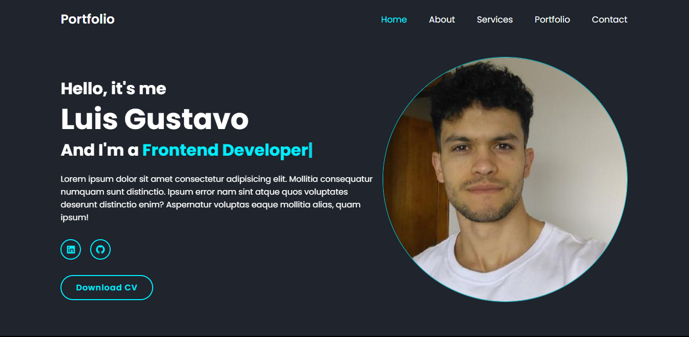

<h1 align="center"> MyPortfolio </h1>

Portfolio web do desenvolvedor Luis Gustavo.  

  <a href="#-tecnologias">Tecnologias</a>&nbsp;&nbsp;&nbsp;|&nbsp;&nbsp;&nbsp;
  <a href="#-projeto">Projeto</a>&nbsp;&nbsp;&nbsp;|&nbsp;&nbsp;&nbsp;
  <a href="#-layout">Layout</a>&nbsp;&nbsp;&nbsp;|&nbsp;&nbsp;&nbsp;
  <a href="#memo-licença">Licença</a>

  

 

  

## 🚀 Tecnologias

Esse projeto foi desenvolvido com as seguintes tecnologias:

- HTML e CSS
- JavaScript
- Git e Github
- Typed JS
- Scroll Reveal

## 💻 Projeto

O Portfolio é um projeto que desenvolvi para apresentar minhas experiências profissionais e as tecnologias que estou estudando atualmente

- [Acesse o projeto finalizado, online](https://lgustta13.github.io/my-portfolio/)

## 🔖 Layout

O projeto não apresenta Layout. Desenvolvido por meio de pesquisas na Internet.

## :memo: Licença

Esse projeto está sob a licença Apache.

---

